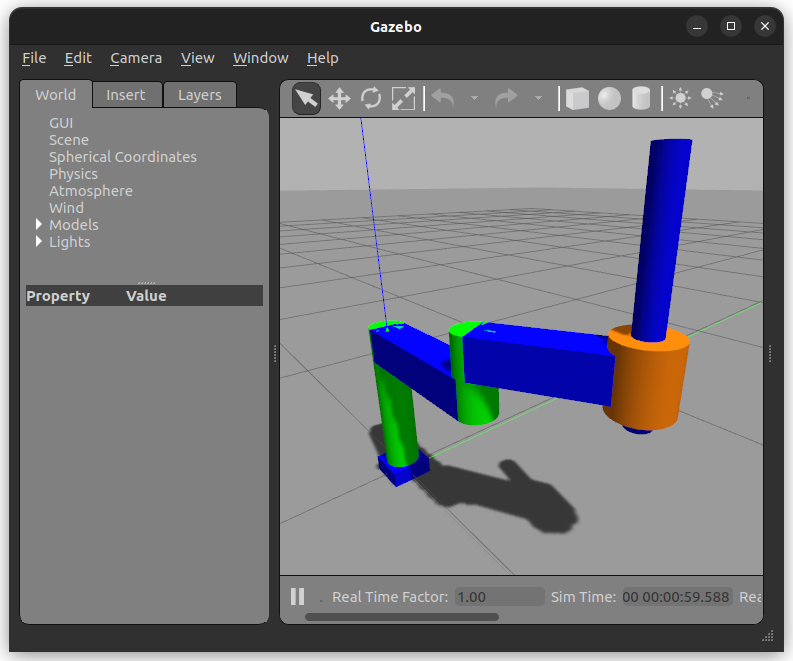

# Setting up the SCARA manipulator to run with ros2_control and Gazebo 
Whereas using simulated hardware is very important to test the kinematic properties of the robot, in many application the use of robot dynamics and interactions with the environment is required. The [Gazebo](https://gazebosim.org/home) simulator is often used in ROS2 projects as it easy to combine ROS2 with Gazebo. Also, ros2_control has specific Hardware Interfaces that allow to simulate a hardware inside Gazebo while using controllers in the ros2_control framework. 

In this section of the tutorial, we will focus on how to simulate the SCARA robot in Gazebo with ros2_control and how to interact with it. 

## Adding the Gazebo description to the URDF
In order to use ros2_control with Gazebo, some additional setup steps are required in the robot description. In fact, Gazebo allows to implement Gazebo plugins to interact with the simulation, what is used to create a bridge between Gazebo and ros2_control. The `gazebo_ros2_control` plugin is used for this reason. In contrary to the previous steps where the Controller Manager was acting as a standalone ROS2 node, in this case the `gazebo_ros2_control` plugin is responsible of running an instance of the Controller Manager inside the Gazebo node.   

This can be done by adding a [`scara.gazebo.xacro`](../scara_description/gazebo/scara.gazebo.xacro) configuration file in the `scara_description` package, that contains:

```xml
<?xml version="1.0"?>
<robot xmlns:xacro="http://www.ros.org/wiki/xacro" name="scara">
    <!-- ros_control plugin -->
    <gazebo>
      <plugin filename="libgazebo_ros2_control.so" name="gazebo_ros2_control">
        <parameters>$(find scara_description)/config/scara_controllers.yaml</parameters>
        <robot_param_node>robot_state_publisher</robot_param_node>
      </plugin>
    </gazebo>
    <!-- Used for fixing robot -->
    <gazebo reference="world">
        <static>true</static>
    </gazebo>

    <!-- color -->
    <gazebo reference="base_link">
      <material>Gazebo/Blue</material>
    </gazebo>

    <!-- materials for other links -->

</robot>
```
In this description file, the `gazebo` tags are used to specify parameters to be used by Gazebo and in particular the `plugin` that needs to be loaded. The plugin here is the `gazebo_ros2_control` plugin contained in the `libgazebo_ros2_control.so` library. This plugin takes 2 parameters in the same way as the ControllerManager before, which are the [`scara_controllers.yaml`](../scara_description/config/scara_controllers.yaml) configuration file and the name of the node that published the `robot_description` topic, which is by default done by the `robot_state_publisher` node. The `gazebo` tags are also used to add additional gazebo parameters to already defined objects. Here we use them to fix the robot to a static world frame and to add a color to each link. 

This description file can then be added to the [`scara.config.xacro`](../scara_description/config/scara.config.xacro) by adding:
``` xml
<!-- Import all Gazebo-customization elements -->
<xacro:include filename="$(find scara_description)/gazebo/scara.gazebo.xacro"/>
```

## Adding the Gazebo ros2_control Hardware Interface
Now that the ros2_control plugin was added to the description, we also need to specify the ros2_control Hardware Interface that needs to be used to link the Gazebo hardware with ros2_control. To do so we just need to specify the `GazeboSystem` hardware interface plugin in the ros2_control urdf description [file](../scara_description/ros2_control/scara.ros2_control.urdf) as follows:
```xml
<?xml version="1.0"?>
<robot name = "scara" xmlns:xacro="http://www.ros.org/wiki/xacro">
    <ros2_control name="scara" type="system">
        <hardware>
            <plugin>gazebo_ros2_control/GazeboSystem</plugin>
        </hardware>
    <!-- joints, gpios, sensors -->
    </ros2_control>
</robot>
```
## Launching Gazebo with ros2_control
Once the description is complete, we need to modify the launch file so that it can launch Gazebo and spawn the robot from the URDF description. 

The Gazebo node has its own launch file that can be included in our launch file as follows: 
```python
gazebo = IncludeLaunchDescription(
    PythonLaunchDescriptionSource(
        [PathJoinSubstitution(
            [FindPackageShare('gazebo_ros'),
                'launch', 'gazebo.launch.py']
        )]
    ),
    launch_arguments={'verbose': 'false'}.items(),
)
```

To spawn the robot from its description to Gazebo a dedicated spawner node is available and can be called as follows:  
```python 
spawn_entity = Node(
    package='gazebo_ros',
    executable='spawn_entity.py',
    arguments=['-topic', robot_description, '-entity', 'scara'],
    output='screen',
)
```
The arguments that are given here are:
* The `topic` parameter, specifying the topic name in which the robot description is published. This topic is usually published by the `robot_state_publisher` node.
* The `entity` parameter, specifying the name of the robot to be spawned as given in the URDF description.

See the [`scara_gazebo.launch.py`](../scara_bringup/launch/scara_gazebo.launch.py) file for the complete launch file.

Notice that because the Controller Manager is already running inside the Gazebo node, it will not be launched here. 

You can now run the launch file using: 
```shell
$ ros2 launch scara_bringup scara_gazebo.launch.py 
```
You should have Gazebo displaying the scara robot running as a Gazebo ros2_control hardware


You can now load and interact with it as explained in the previous [section](launch_tutorial.md).