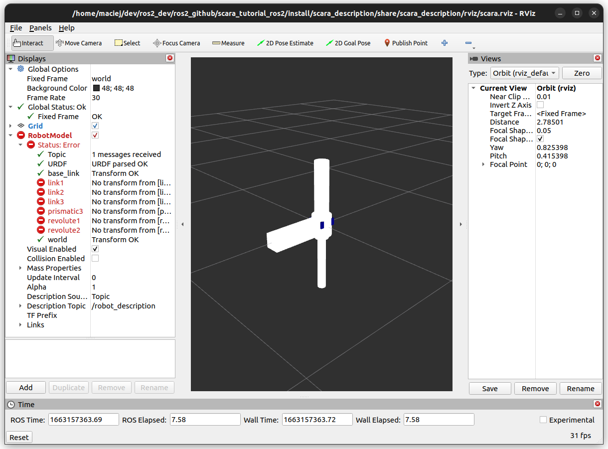
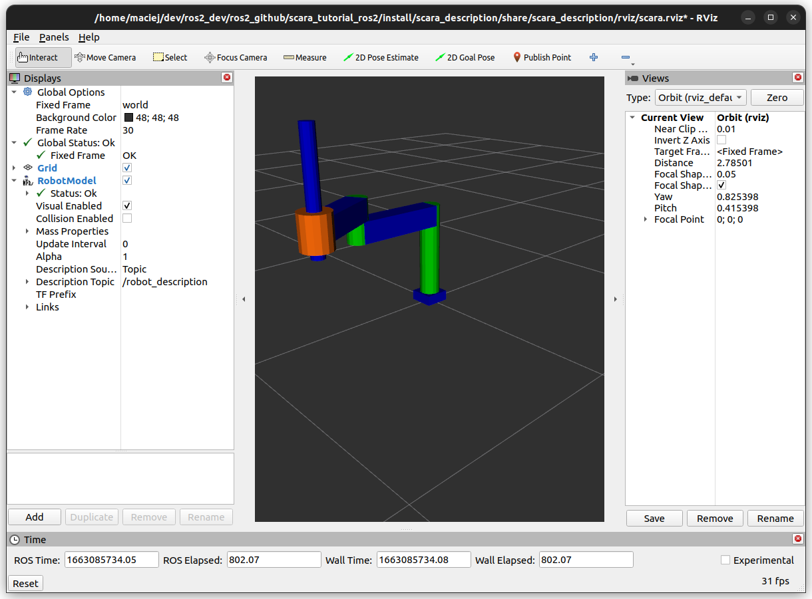

# Launching and interacting with the Scara robot
In ros2_control, there is one main node responsible for running the framework, which is the `ControllerManager`. In this section, we will focus on how to set up and run this node and how to interact with it. 

## Configuring the Controller Manager
The `ControllerManager` node requires in addition to the robot description a configuration file with additional parameters, such as the control loop update rate, as well as a list of the desired controllers and their parameters. Such a configuration file is usually formatted as follows:  
```yaml
controller_manager:
  ros__parameters:
    update_rate: 100  # Hz

    {controller_name}:
        type: {namespace}/{class_name}

{controller_name}:
  ros__parameters:
    # controller parameters
```
In the controller configuration file, the `update_rate` parameter allows to set the update rate of the `ControllerManager` node. In addition, the desired controllers that we plan to run need to be referenced and set up. 

In the example of the scara robot, the configuration [file](../scara_description/config/scara_controllers.yaml) is the following:  
```yaml
controller_manager:
  ros__parameters:
    update_rate: 100  # Hz

    joint_state_broadcaster:
      type: joint_state_broadcaster/JointStateBroadcaster

    scara_position_controller:
      type: position_controllers/JointGroupPositionController

scara_position_controller:
  ros__parameters:
    joints:
      - joint1
      - joint2
      - joint3
```
In this configuration the `update_rate` is set at 100Hz and 2 controllers are referenced:
* The `joint_state_broadcaster`, which is of type `JointStateBroadcaster`, is a general purpose controller available in the [`ros2_controllers`](https://github.com/ros-controls/ros2_controllers) package. This controller is a broadcaster, which means that it does not command the robot but only publishes its state to make it available to other ros2 components.
* The `scara_position_controller`, which is of type `JointGroupPositionController`, is also a general purpose controller available in the [`ros2_controllers`](https://github.com/ros-controls/ros2_controllers) package. The purpose of this controller is to command the robot joints using the position interface. 

Notice here, that in contrary to the `joint_state_broadcaster` that streams by default all states of all joints, the `scara_position_controller` requires additional parameters that specify the targeted joint names. 

For more information about available controllers and their usage refer to the [`ros2_controllers`](https://github.com/ros-controls/ros2_controllers) package. 

Now that we have the robot URDF description and the configuration for the Controller Manager node, let's create a launch file to run the scara robot. 

## Creating a launch file

In the [`scara.launch.py`](../scara_bringup/launch/scara.launch.py) file, we first need to load the robot description from URDF. As we use XACRO, the global description file [`scara.config.xacro`](../scara_description/config/scara.config.xacro) of the robot needs to be evaluated first, what can be achieved as follows:
```python
robot_description_content = Command([
    PathJoinSubstitution([FindExecutable(name='xacro')]),
    ' ',
    PathJoinSubstitution(
        [FindPackageShare('scara_description'), 'config', 'scara.config.xacro']
    ),
])
robot_description = {'robot_description': robot_description_content}
```

In addition we need to load the previously defined configuration file for the Controller Manager. This can be done as follows: 

```python
robot_controllers = PathJoinSubstitution(
    [
        FindPackageShare('scara_description'),
        'config',
        'scara_controllers.yaml',
    ]
)
```
With this done, we can now create a node running the ros2_control Controller Manager as follows:
```python
control_node = Node(
        package='controller_manager',
        executable='ros2_control_node',
        parameters=[robot_description, robot_controllers],
        output='both',
    )
```
For the purpose of this tutorial you will also need to launch an `rviz2` node as well as `robot_state_publisher`, which are required to have a visual of the scara robot. 

See [here](../scara_bringup/launch/scara.launch.py) for the complete launch file used for this tutorial. 

## Running and interacting with the scara robot

After building your workspace, you can run the launch file using:
```shell
$ ros2 launch scara_bringup scara.launch.py 
```
A RViz2 window should open and display the following:


This output indicates that the `robot_state_publisher` node does not have any information about the robot current state. This is not an error in the configuration of your robot and is due to the fact that by default, the `controller_manager` node does not load any controllers, including the `joint_state_broadcaster` responsible for sharing the state data with the ROS2 environment. 

The ros2_control framework comes with some [command line functionalities](https://control.ros.org/master/doc/ros2_control/ros2controlcli/doc/userdoc.html) that allow you to interact with Controller Manager. For example, to see what are the hardware interfaces that are currently running, run in a new terminal: 
```shell
$ ros2 control list_hardware_interfaces
```
which should produce the following output: 
```shell
command interfaces
	joint1/position [available] [unclaimed]
	joint2/position [available] [unclaimed]
	joint3/position [available] [unclaimed]
state interfaces
	joint1/position
	joint1/velocity
	joint2/position
	joint2/velocity
	joint3/position
	joint3/velocity
```
This shows, as expected from the robot description, that a position command interface is available for all joints and that for each joint there is a position and velocity state interface. Notice also the `unclaimed` flag next to the command interfaces. This flag indicates that no controller was loaded to claim this particular command interface. In fact, if you now run:
``` shell
$ ros2 control list_controllers
```
It will give you and empty output. In this case, let's load the `joint_state_broadcaster`. To do so, run in your terminal:
```shell
$ ros2 control load_controller joint_state_broadcaster --set-state active
```
what should return;
```shell
Successfully loaded controller joint_state_broadcaster into state active
```
Now have a look at your RViz2 window. It should finally display the expected output:


Also, if you run again:
``` shell
$ ros2 control list_controllers
```
it will output:
```shell
joint_state_broadcaster[joint_state_broadcaster/JointStateBroadcaster] active
```
This means that only the `joint_state_broadcaster` is currently running. This particular controller is responsible for reading the states from the hardware and publishing them in the `\joint_states` topic, so that it can be interpreted by the robot state publisher node and displayed in RViz2. You can also read the current state of the robot by listening directly to the `\joint_states` topic by running:
```shell
$ ros2 topic echo /joint_states
```
Even though the `joint_state_broadcaster` is a controller, it does not command any interface of the robot. In the next section, let's focus on running another controller that this time will move the robot. 

## Controlling joints with controllers

Let's now focus on another controller that was set up in the [`scara_controllers.yaml`](../scara_description/config/scara_controllers.yaml) configuration file. In order to give position commands to the scara robot, load the `scara_position_controller` by running:  
```shell
$ ros2 control load_controller scara_position_controller --set-state active
```
Now if you run:
``` shell
$ ros2 control list_controllers
```
that should give you: 
``` shell
joint_state_broadcaster[joint_state_broadcaster/JointStateBroadcaster] active    
scara_position_controller[position_controllers/JointGroupPositionController] active 
```
Your `scara_position_controller` is now ready to receive position commands. In fact, if you run 
```shell
$ ros2 topic list
```
you will see that a new topic `/scara_position_controller/commands` appeared. Let's inspect this topic by running :
```shell 
$ ros2 topic info /scara_position_controller/commands 
```
which will output:
```shell 
Type: std_msgs/msg/Float64MultiArray
Publisher count: 0
Subscription count: 1
```
This shows you that the expected command message format is of type `Float64MultiArray`. Let's check how this message type is defined by running :
``` shell
$ ros2 interface show std_msgs/msg/Float64MultiArray
```
which will return :
```shell
# Please look at the MultiArrayLayout message definition for
# documentation on all multiarrays.

MultiArrayLayout  layout        # specification of data layout
float64[]         data          # array of data
```
The expected message is an array of `float64`. Let's now publish a set of position commands on that topic: 
```shell
ros2 topic pub --once /scara_position_controller/commands std_msgs/msg/Float64MultiArray "{data: [0.5,-1.5,0.3]}"
```
Your robot moved to the desired position! 
Notice here that the motion to the desired position was done in one shot, what on a real robot would require excessive torques. In the case of a real robot, it would be more suited to use another controller that is able of interpolating the robot motion such as the [`joint_trajectory_controller`](https://control.ros.org/master/doc/ros2_controllers/joint_trajectory_controller/doc/userdoc.html). After adding the new controller to the configuration [file](../scara_description/config/scara_controllers.yaml) as the `scara_trajectory_controller`, let's see how to switch from one controller to the other. We consider that the application was not stopped and that the `scara_position_controller` is still running.

At first, the new controller needs to be loaded. If we run the previous command:
```shell
$ ros2 control load_controller scara_trajectory_controller --set-state active
```
it will return:
```shell
[ERROR] [1663347965.049772820] [controller_manager]: Resource conflict for controller 'scara_trajectory_controller'. Command interface 'joint1/position' is already claimed.
```
As explained in the [overview section](r2c_overview.md), the command interfaces are exclusively accessed to avoid this particular case where two controllers claim the same interface. To deal with it, the `scara_position_controller` needs to release the interface before the `scara_trajectory_controller` can claim it. One way of doing it is to first deactivate the `scara_position_controller` by running:
```shell
$ ros2 control set_controller_state scara_position_controller inactive 
```
and then activate the other controller by running:
```shell
$ ros2 control set_controller_state scara_trajectory_controller active 
```
As a result, the controllers are switched what can be checked running once again:
``` shell
$ ros2 control list_controllers
```
that should give you: 
``` shell
joint_state_broadcaster[joint_state_broadcaster/JointStateBroadcaster] active    
scara_position_controller[position_controllers/JointGroupPositionController] inactive 
scara_trajectory_controller[joint_trajectory_controller/JointTrajectoryController] active
```

Alternatively, in order to avoid the period where teh hardware is not controlled, both actions can be done simultaneously by running: 
```shell
$ ros2 control switch_controllers --deactivate scara_position_controller --activate scara_trajectory_controller
```

Notice that in order to be able to activate the `scara_trajectory_controller`, its state needs to be `inactive` meaning that is was already configured. In order to configure the controller without activating it, you can run: 
```shell
ros2 control load_controller scara_trajectory_controller --set-state configured
```


## Additional comments on controllers
In ros2_control, controllers can be loaded, unloaded and switched on runtime without stopping the hardware. This allows to address the need of applications that have multiple different operating phases. More information can be found [here](https://control.ros.org/master/index.html).

Also, in most applications the controller to be loaded is known from start and therefore it can be loaded directly at startup in the [launch](../scara_bringup/launch/scara.launch.py) file by calling the `spawner` node:
```python
controller_spawner = Node(
        package='controller_manager',
        executable='spawner',
        arguments=['<controller_name>'],
    )
```

Some additional information about available controllers can be found [here](https://control.ros.org/master/doc/ros2_controllers/doc/controllers_index.html). If, however, for the purpose of your applications you need a custom controller, you can go to the [section on how to develop one](controller_tutorial.md). 