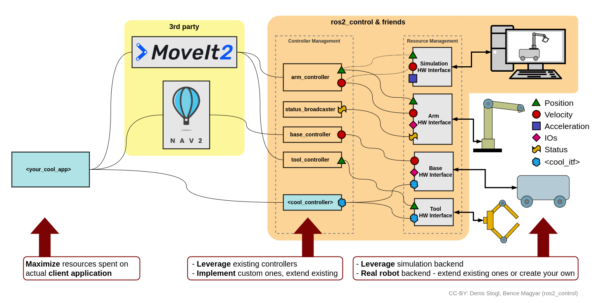
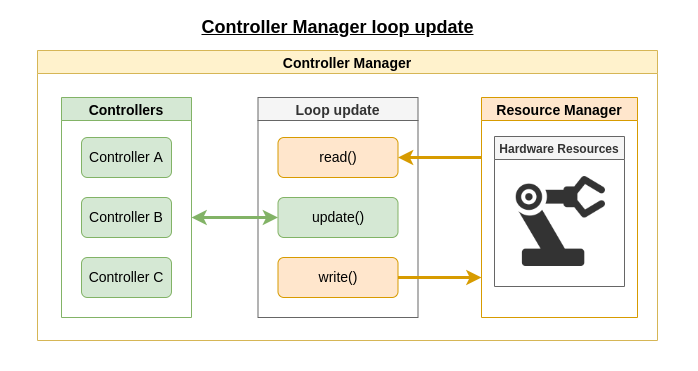
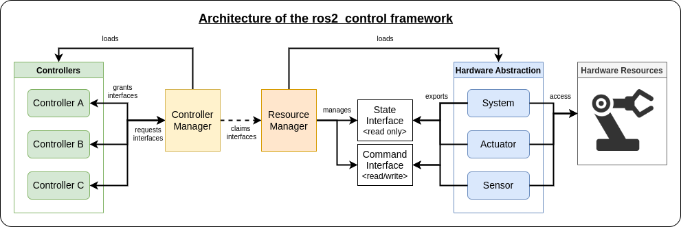

# Overview of the ros2_control framework

The [ros2_control](https://control.ros.org) framework is a realtime control framework designed for general robotics applications. It is an abstraction layer for simple integration of hardware and controllers. The ros2_control framework comes with standard interfaces to enhance code modularity and robot agnostic design. Application specific details, such as the controller to be used or the robot description, are easily specified via configuration files. Finally, the ros2_control framework can easily be deployed via ROS2 launch a file.

All these features of ros2_control allow to focus on the design of complex application by taking advantage of the possibility to use and reuse as often as possible existing controllers, hardware drivers and freely switch between simulation and execution on a real robotic system. Also, the effort spent on the development of custom controllers or hardware interfaces can easily be reused in many other projects. Finally, using standard components allows to easily integrate 3rd party ROS2 packages into the developed applications.

In order to better understand how the framework works, let's focus at the components it consists of. 

## Controller Manager

The Controller Manager is the main component in the ros2_control framework, which connects the controllers and hardware-abstraction sides of the framework. It also serves as the entry-point for users through ROS services. The Controller Manager implements a node without an executor so it can be integrated into a custom setup. Still, for a standard user, it is recommended to use the default node-setup implemented in `ros2_control_node` file from the `controller_manager` package.

On the one side, Controller Manager manages (e.g., loading, activating, deactivating, unloading) controllers and the interfaces they require. On the other side, it has access to the hardware components through the Resource Manager. The Controller Manager matches required and provided interfaces, gives controllers access to hardware when activated, or reports an error if there is an access conflict.

The execution of the different components of the ros2_control framework in the control-loop is managed by the Controller Manager. At each loop iteration, it reads data from the hardware components, updates outputs of all active controllers, and writes the result to the components.

The Controller Manager's control loop update can be summarized as follows:

## Resource Manager

The Resource Manager abstracts physical hardware and its drivers (called hardware components) for the ros2_control framework. The Resource Manager loads the components as plugins. It also manages the components' lifecycle and as well as state and command interfaces. This abstraction provided by the Resource Manager enables re-usability of implemented hardware components, e.g., robot and gripper, without any implementation and flexible hardware application for state and command interfaces, e.g., separate hardware/communication libraries for motor control and encoder reading.

In the control loop execution managed by the Controller Manager, the Resource Manager’s `read()` and `write()` methods are called and deal with communication to the hardware components.

## Controllers

The controllers in the ros2_control framework have the same functionality as defined in the control theory. They compare the reference value with the measured output and, based on this error, calculate a system’s input. The controllers are loaded as plugins making their development independent of the framework. In ros2_control, controllers are [managed node](https://design.ros2.org/articles/node_lifecycle.html), which means that they work as state-machines and thus have a finite set of states, which are:

1. Unconfigured
2. Inactive
3. Active
4. Finalized

This configuration has several advantages:
- It allows to have greater control over the current state of the controller and ensure that it has been correctly instantiated before being executed. 
- It allows to load, restart and replace controllers on-line. 

Notice here also, that in order to be executed by the Controller Manager and command the hardware, the controller needs to be in `active` state. 

When executing the control-loop, the Controller Manager calls the `update()` method of all controllers. This method can access the latest hardware states and enable the controller to send commands to the hardware interfaces.

## Hardware Abstraction 

The hardware abstraction layer is done using ros2_control hardware components that realize the communication to physical hardware and represent its abstraction in the ros2_control framework. The components have to be exported as plugins. The Resource Manager dynamically loads those plugins and manages their lifecycle.

There are three basic types of components:

1. __System__: Complex (multi-DOF) robotic hardware like industrial robots. The main difference between the Actuator component is the possibility to use complex transmissions like needed for humanoid robot’s hands. This component has reading and writing capabilities. It is used when the is only one logical communication channel to the hardware, such as when using a robot driver and SDK.

2. __Sensor__: Hardware used for sensing some environment parameters. This component type has only reading capabilities.

3. __Actuator__: Simple (1 DOF) robotic hardware like motors, valves, and similar. An actuator implementation is related to only one joint. This component type has reading and writing capabilities. Reading is not mandatory if not possible (e.g., DC motor control with Arduino board). The actuator type can also be used with a multi-DOF robot if its hardware enables modular design, e.g., CAN-communication with each motor independently.

## State and Command Interfaces

Finally, the ros2_control framework introduces `state_interfaces` and `command_interfaces` to abstract hardware interfacing. The `state_interfaces` are read only data handles that generally represent sensors readings, e.g. joint encoder. The `command_interfaces` are read and write data handles that are used to pass commands to the hardware. The `command_interfaces` are exclusively accessed, meaning if a controller has "claimed" an interface, it cannot be used by any other controller until it is released. This guarantees that two controllers will never be able to send commands to the same hardware in the same time, what could have a dangerous outcome. Both `state_interfaces` and `command_interfaces` are set up together with the hardware using configuration files.

The overall architecture of the ros2_control framework can be summarized as follows:

