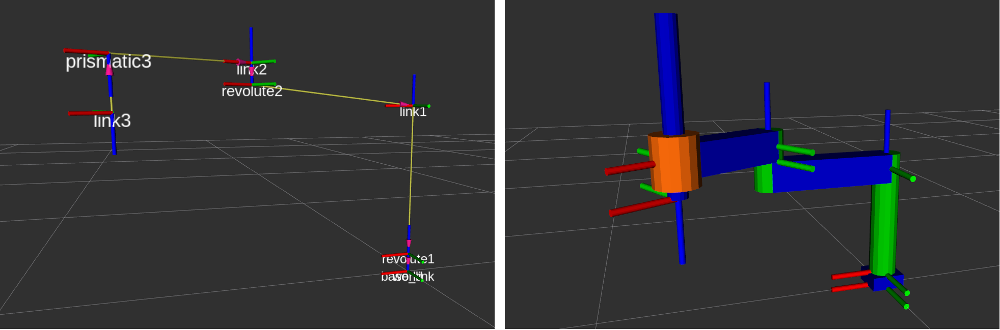

# Writing the URDF description of the SCARA robot
The URDF file is a standard XML based file used to describe characteristic of a robot. It can represent any robot with a tree structure, except those with cycles. Each link must have only one parent. For ros2_control, there are three primary tags: `link`, `joint`, and `ros2_control`. The `joint` tag define the robot's kinematic structure, while the `link` tag defines the dynamic properties and 3D geometry. The `ros2_control` defines the hardware and controller configuration.

A good practice in ROS2 is to specify the description of the used robot in a dedicated package. In this tutorial, the package is named in a standard way `scara_description`. In this package you can find different folders containing the configuration of the used system for different ROS2 components. 

## Global URDF description using Xacro
In order to simplify the setup of the robot we often build the robot URDF description using `xacro`. Xacro (XML Macros) is an XML macro language. With xacro, you can construct shorter and more readable XML files by using macros that expand to larger XML expressions. Using xacro allows to include smaller segments of the system description for better readability. For example, in the case of the scara robot, the global URDF is defined using the [scara.config.xacro](../scara_description/config/scara.config.xacro) file, formatted as follows: 
```xml 
<?xml version="1.0"?>
<!-- Scara manipulator -->
<robot xmlns:xacro="http://www.ros.org/wiki/xacro" name="scara">

    <!-- Import scara urdf file -->
    <xacro:include filename="$(find scara_description)/urdf/scara.urdf" />

    <!-- Import scara materials file -->
    <xacro:include filename="$(find scara_description)/config/materials.urdf" />

    <!-- Import scara ros2_control description -->
    <xacro:include filename="$(find scara_description)/ros2_control/scara.ros2_control.urdf" />

</robot>
```
In this xml description:
* The `robot` tag encloses all contents of the URDF file. It has a name attribute which must be specified.
* The `xacro:include` tag is used to import the geometric description, the materials file and the ros2_control description.

In the next sections, let's focus more in details on the included description files. 

## Geometry and Dynamics

In this section, let's focus on the [`scara.urdf`](../scara_description/urdf/scara.urdf) description file. The URDF file describes in details the geometry of the robot as well as some additional parameters such as its visual and collision meshes, dynamics and others. 

Let's create a robot description for a scara robot with the following structure:



The resulting URDF description file is generally formatted as follows: 

``` xml
<?xml version = "1.0"?>
<robot name = "scara" xmlns:xacro="http://www.ros.org/wiki/xacro">

  <!-- Used for fixing robot to 'base_link' -->
  <link name="world"/>

  <!-- Base Link -->
  <link name = "base_link">
    <visual>
      <geometry>
        <box size = "0.12 0.12 0.05"/>
      </geometry>
      <material name = "blue"/>
      <origin xyz = "0 0 0.025"/>
    </visual>
    <inertial>
      <mass value="1" />
      <origin xyz="0 0 0.025" rpy="0 0 0" />
      <inertia ixx="1" ixy="0" ixz="0" iyy="1" iyz="0" izz="1" />
    </inertial>
    <collision>
      <geometry>
        <box size = "0.12 0.12 0.05"/>
      </geometry>
      <material name = "blue"/>
      <origin xyz = "0 0 0.025"/>
    </collision>
  </link>

  <joint name="base2world" type="fixed">
    <parent link="world"/>
    <child link="base_link"/>
  </joint>

  <!-- revolute1 1 -->
  <link name = "revolute1">
    <visual>
      <geometry>
        <cylinder length = "0.45" radius = "0.05"/>
      </geometry>
      <material name = "green"/>
      <origin xyz = "0 0 0.225"/>
    </visual>
    <inertial>
      <mass value="0.5" />
      <origin xyz="0 0 0.05" rpy="0 0 0" />
      <inertia ixx="0.5" ixy="0" ixz="0" iyy="0.5" iyz="0" izz="0.5" />
    </inertial>
    <collision>
      <geometry>
        <cylinder length = "0.45" radius = "0.05"/>
      </geometry>
      <material name = "green"/>
      <origin xyz = "0 0 0.225"/>
    </collision>
  </link>

  <joint name = "joint1" type="revolute">
    <parent link = "base_link"/>
    <child link = "revolute1"/>
    <origin xyz = "0 0 0.05"/>
    <limit effort="1000.0" lower="-1.57" upper="1.57" velocity="0.5"/>
    <axis xyz = "0 0 1"/>
    <dynamics damping="0.2" friction="0.1" />
  </joint>

  <!-- additional links and joints -->
 
</robot>
```
In this xml description:
* The `robot` tag encloses all contents of the URDF file. It has a name attribute which must be specified.
* The `link` tag defines the robot's geometry and inertia properties. It has a name attribute which will be referred to by the `joint` tags.
* The `visual` tag specifies the rotation and translation of the visual shapes. The shapes require to set the `origin` tag to fit the desired link shape.
* The `geometry`, `box` and `cylinder` tags specify the geometry of the robot link. Alternatively, you can also use the `mesh` tag to specify the location of the 3D mesh file relative to a specified ROS 2 package.
* The `collision` tag is equivalent to the `visual` tag, except the specified mesh is used for collision checking in some applications.
* The `inertial` tag specifies mass and inertia for the link. The origin tag specifies the link's center of mass. These values are used to calculate forward and inverse dynamics. Since our application does not use dynamics, uniform arbitrary values are used.
* The `<!-- additional links ... -->` comments indicates that many consecutive `link` tags will be defined, one for each link.
* The `<link name="world"/>` and `<link name="tool0"/>` elements are not required. However, it is convention to set the link at the tip of the robot to  tool0 and to define the robot's base link relative to a world frame.
* The `joint` tag specifies the kinematic structure of the robot. It two required attributes: name and type. The type specifies the viable motion between the two connected links. The subsequent `parent` and `child` links specify which two links are joined by the joint.
* The `axis` tag species the joint's axis of rotation. If the meshes were process as described previously, then the axis value is always `"0 0 1"`.
* The `limits` tag specifies kinematic and dynamic limits for the joint.
* The `dynamics` tag specifies some dynamics properties of the joint such as its damping or friction coefficients.

## Hardware Interface setup for ros2_control

In this section, let's focus on the [`scara.ros2_control.urdf`](../scara_description/ros2_control/scara.ros2_control.urdf) description file. This description file is used to set up the ros2_control hardware that will be used to specify the `command_interface` and `state_interface` for each `joint`, `sensor` and/or `gpio`. 

The ros2_control description is generally formatted as follows:  

```xml
<?xml version="1.0"?>
<robot name = "scara" xmlns:xacro="http://www.ros.org/wiki/xacro">

    <ros2_control name="scara" type="system">

        <hardware>
            <plugin>mock_components/GenericSystem</plugin>
        </hardware>

        <joint name="joint1">
            <command_interface name="position" />
            <state_interface name="position">
                <param name="initial_value">0.0</param>
                <param name="min">-1.57</param>
                <param name="max">1.57</param>
            </state_interface>
            <state_interface name="velocity"> 
                <param name="initial_value">0.0</param> 
            </state_interface>
        </joint>
        
        <!-- additional joints -->

    </ros2_control>

</robot>
```
In this xml description:
* The `robot` tag encloses all contents of the URDF file. It has a name attribute which must be specified.
* The `hardware` and `plugin` tags instruct the ros2_control framework to dynamically load a hardware driver conforming to `HardwareInterface` as a plugin. The plugin is specified as `{Name_Space}/{Class_Name}`. In this case we use the `GenericSystem` hardware which is a general purpose simulation hardware available in the [`ros2_control`](https://github.com/ros-controls/ros2_control) package. 
* The`joint` tag specifies the state and command interfaces that the loaded plugin will offer. The joint is specified with the name attribute. The `command_interface` and `state_interface` tags specify the interface type, usually position, velocity, acceleration, or effort. Additionally, for each interface additional parameters such as `min`, `max` and `initial_value` can be set.  

The hardware interface that can be loaded here as a plugin is dependant of the type of robot that is controlled and its control mode. It is an interface between ros2_control and the robot driver. For robots that support ros2_control, the interface is often given either by the manufacturer or the community. A non exhaustive list of available hardware interfaces can be found [here](https://control.ros.org/master/doc/supported_robots/supported_robots.html). 

At this point you can either go further to the next [section on how to launch and interact with the current system](launch_tutorial.md). In the case where the hardware interface that you want to use is not already available, you can go to the [section on how to develop a custom one](hardware_tutorial.md). 